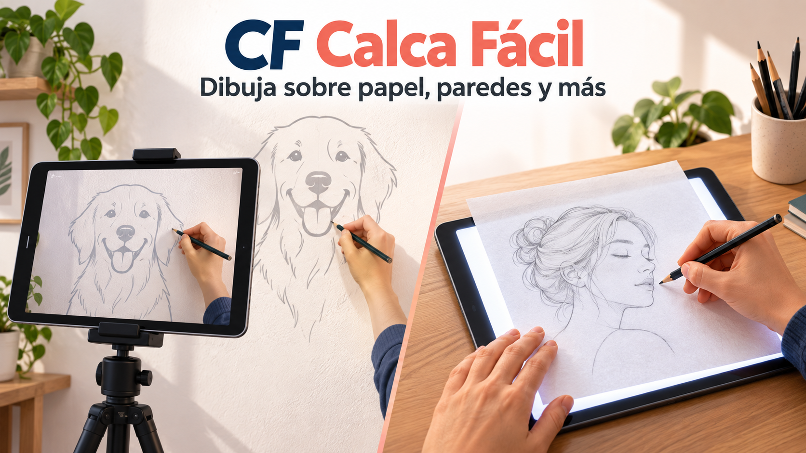

# CF Calca Fácil

**Dos formas de calcar, una sola app.**

Aplicación Android gratuita para usar una imagen como guía mientras dibujas. Permite calcar directamente sobre la pantalla, superponer un dibujo sobre la cámara o mostrar una cámara flotante encima de otra aplicación.



## ¿Para qué sirve?

CF Calca Fácil ayuda a transferir una imagen a mano sobre papel, cuadernos, cartulina, lienzos, madera, tela y paredes. La app no dibuja automáticamente: mantiene una referencia visual estable para seguir sus líneas con lápiz, marcador o pintura.

La explicación completa y los consejos de uso están en el artículo [CF Calca Fácil: app gratis para calcar dibujos en papel, paredes y más](https://christianfontalvo.com/cf-calca-facil-app-gratis-calcar-dibujos/).

## Modos de calco

### Sobre la pantalla

1. Elige uno de los dibujos incluidos o una imagen del dispositivo.
2. Ajusta su tamaño, posición y orientación.
3. Coloca el papel sobre la pantalla con cuidado.
4. Bloquea el dibujo para evitar movimientos accidentales.
5. Toca tres veces el botón flotante para recuperar los controles.

Este modo aumenta el brillo, mantiene la pantalla encendida y muestra la imagen con máxima visibilidad.

### Con la cámara

La cámara trasera ocupa toda la pantalla, tanto en vertical como en horizontal, y muestra encima una referencia semitransparente. La transparencia se puede ajustar para equilibrar la visibilidad del dibujo y de la superficie real.

### Cámara sobre otra aplicación

Muestra la cámara de forma semitransparente encima de una imagen abierta en el navegador, la galería, Instagram, Pinterest u otra aplicación. El bloqueo evita tocar accidentalmente la aplicación inferior; los botones Inicio y Recientes siguen disponibles por las restricciones de seguridad de Android.

## Funciones

- Galería con cinco dibujos originales incluidos.
- Selección de imágenes guardadas en el dispositivo.
- Movimiento, zoom y rotación mediante gestos.
- Giro de 90 grados y volteo horizontal o vertical.
- Cámara trasera sin zoom digital inicial.
- Transparencia regulable en los modos de cámara.
- Alto brillo y pantalla siempre encendida durante el calco.
- Bloqueo y desbloqueo mediante tres toques.
- Cámara flotante sobre otras aplicaciones.
- Enlaces al blog y a [@christianfontalvosketch](https://www.instagram.com/christianfontalvosketch/).
- Funcionamiento local, sin cuenta, anuncios ni subida de imágenes.

## Permisos Android

- **Cámara:** necesaria para los modos que utilizan la cámara trasera.
- **Mostrar sobre otras aplicaciones:** necesaria únicamente para la cámara flotante. Android solicita activarla desde los ajustes del dispositivo.
- **Servicio visible y notificaciones:** mantienen la cámara activa y muestran una notificación mientras el modo flotante está funcionando.

Consulta la [política de privacidad](PRIVACY.md) para conocer cómo se tratan las imágenes y los permisos.

## Estado del proyecto

- Versión: `0.2.2+4`.
- Estado: beta para Android.
- Compatibilidad: Android 7.0 o posterior.
- Identificador: `com.christianfontalvo.cfcalcafacil`.
- APK público: [descargar CF Calca Fácil v0.2.2 beta](https://github.com/CFontalvo/cf-calca-facil/releases/tag/v0.2.2-beta.1).

El APK se ofrece gratis desde GitHub Releases y no requiere Google Play. Está firmado con un certificado local de desarrollo y se publica como beta, no como una versión de tienda. Consulta las [instrucciones de instalación](docs/INSTALACION.md) antes de descargarlo.

## Desarrollo

Requisitos:

- Flutter compatible con Dart `3.9` o posterior.
- Android SDK.
- Un dispositivo Android con cámara para probar todos los modos.

```bash
git clone https://github.com/CFontalvo/cf-calca-facil.git
cd cf-calca-facil
flutter pub get
flutter analyze
flutter test
flutter run
```

Para generar un APK local de prueba:

```bash
flutter build apk --debug
```

## Estructura principal

- `lib/screens/`: pantallas y modos de calco.
- `lib/widgets/trace_overlay.dart`: transformación, transparencia y bloqueo de la imagen.
- `lib/services/android_bridge.dart`: comunicación con las funciones Android nativas.
- `android/app/src/main/kotlin/`: cámara flotante y servicio visible.
- `assets/drawings/`: dibujos originales incluidos.
- `test/`: pruebas automáticas de la interfaz principal.
- `docs/`: artículo, portada y documentación complementaria.

## Prueba física realizada

Probada en un Samsung Galaxy Note10+ con Android 12:

- Inicio y galería adaptados a la pantalla.
- Los cinco dibujos cargan correctamente.
- Cámara trasera a pantalla completa en vertical y horizontal.
- Encuadre normal de la cámara trasera, sin zoom digital inicial.
- Imagen semitransparente funcionando sobre la cámara.
- Bloqueo y desbloqueo con tres toques.
- Cámara flotante visible sobre otra aplicación.
- Bloqueo de los toques en la aplicación inferior.
- Panel flotante, transparencia y detención funcionando.

Esta validación corresponde al dispositivo indicado y no garantiza el mismo comportamiento en todos los fabricantes o versiones de Android.

## Autor

Creado por [Christian Fontalvo](https://christianfontalvo.com/).

- Blog: [christianfontalvo.com](https://christianfontalvo.com/)
- Dibujos: [Instagram @christianfontalvosketch](https://www.instagram.com/christianfontalvosketch/)
